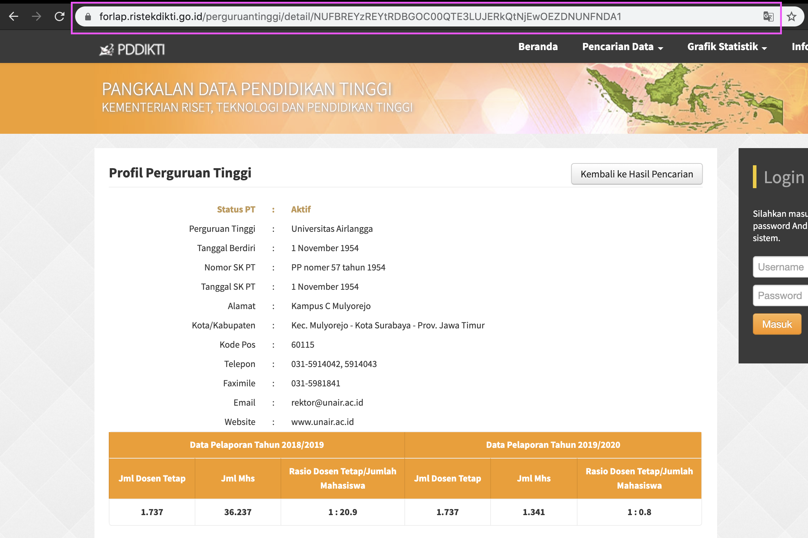

# SCRAPING NAMA MAHASISWA

Script ini di gunakan untuk scraping nama mahasiswa dan jenis kelamin dari laman dikti https://forlap.ristekdikti.go.id/perguruantinggi. 

## Cara Menjalankan Script

* Bukan laman https://forlap.ristekdikti.go.id/perguruantinggi massukkan provinsi yang dicari masukkan angka penjumlahan sesuai yang tertera. Kemudian klik salah satu universitas yang ingin dicari.
  
* Setelah klik copy url yang tertera.

* Kumpulkan semua url dari universitas yang ingin di cari dalam file txt seperti pada file [url.txt](https://github.com/ayunimatulf/scraping_nama_mahasiswa/blob/master/url.txt)
* Contoh script untuk running 
    ```
    python scraping_nama_mhs.py -fn url.txt -fo output/hasil_scrap
    ```
    -fn : nama file dari text file yang berisi url
    -fo : nama file output (tanpa extension)

## Ouput
Proses Running Script

Hasil output dalam csv


## Acknowledgments
* Bisa digunakan untuk membuat model gender classification based on name in Indonesia